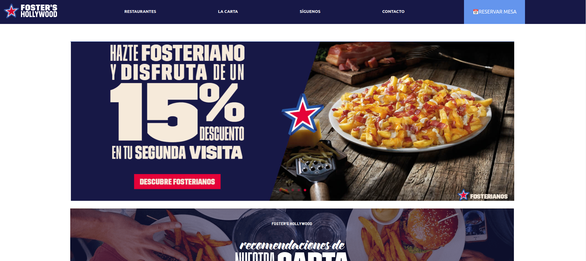
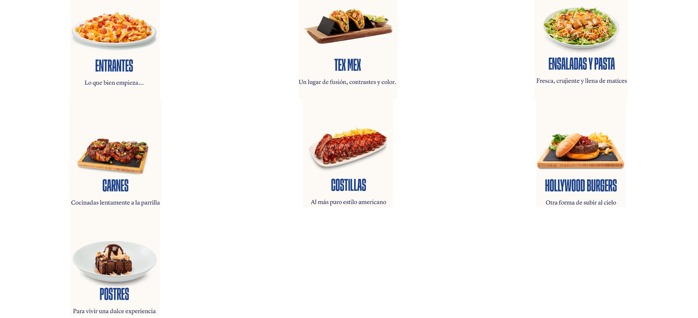
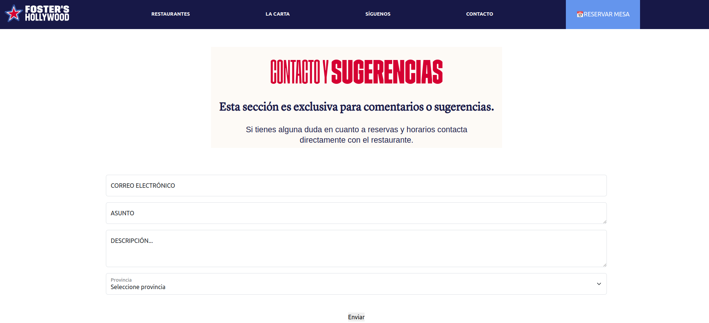
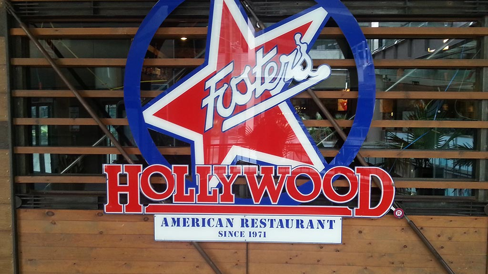
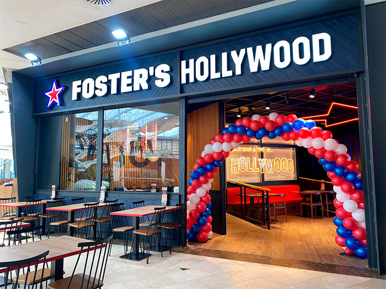
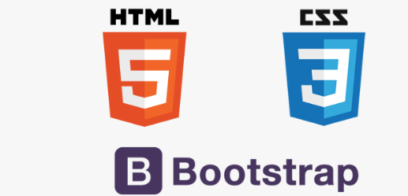

##### Proyecto 2: Carta restaurante con Boostrap.
 

###### Principal

    
###### Carta

 
###### Contacto

    

#  Contenido:
 

- ### [Descripción del proyecto 📋](#Descripción-del-proyecto)
- ### [Acerca de 🍔](#Acerca)
- ### [Desarrollo 🖥️](#Desarrollo)
- ### [Repositorio GitHub 💾](#Repositorio)
- ### [Licencia y Copyright 📜](#Licencia)

    

### Descripción del proyecto
 

#####  Este proyecto se basa en una replica de la pagina de la fammosa cadena de restaurantes Foster Hollywood usando Boostrap.

    

### Acerca de 

 

####  - Foster's Hollywood es una cadena de restaurantes de comida estadounidense localizada en España, cuyos establecimientos son caracterizables entre los llamados casual restaurantes,​ pero entendidos en una cultura ajena como una suerte de «restaurantes étnicos», como pudieran ser los italianos u orientales.
 

####  - La compañía fue fundada el año 1971 por iniciativa de un grupo de jóvenes extranjeros afincados en España (Mark Brownstein, Douglas Delfeld y los hermanos Anthony y Stephen A. Unger) y muy vinculados al mundo cinematográfico, que añoraban la comida típica estadounidense. En su momento fue la primera cadena de restaurantes al estilo estadounidense de España, y una de las primeras de Europa.​
 

####  - El primer restaurante de la cadena se abrió ese mismo año en la calle de Magallanes, Un reportero de The New York Times comentó en su crítica del establecimiento que allí podían comerse probablemente los mejores aros de cebolla del mundo.
 

    

### Desarrollo

 

####    Para este proyecto se ha utilizado HTML, CSS/Layout y BOOSTRAP  también contiene imágenes descargadas de internet.

####  El proyecto se basa en 3 páginas enlazadas entre ellas:
####  -La página principal que contiene imágenes con ofertas, platos recomendados..
####  - La carta que contiene las distintas secciones en que se divide la carta del restaurante.
####  -La página de contacto donde hay un formulario donde el usuario puede rellenar los campos como "email", "nombre y apellidos" y una descripción.
####  -Es totalmente responsive. 

   

    

### Repositorio GitHub

 

#### https://github.com/xIMet3/cartaFosterHollywod

    

### Licencia y Copyright

 

#### DERECHOS DE PROPIEDAD INTELECTUAL E INDUSTRIAL

####  -Todos los contenidos de la página Web (textos, gráficos, fotografías, logos, marcas, iconos, imágenes, sonidos, diseño gráfico, software, tecnología, links, así como su diseño gráfico y códigos fuente, o cualquier otro) son de la exclusiva propiedad de FSP o de las sociedades de su grupo.
 
 

